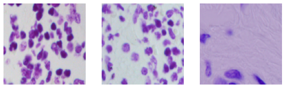
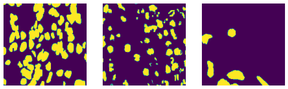
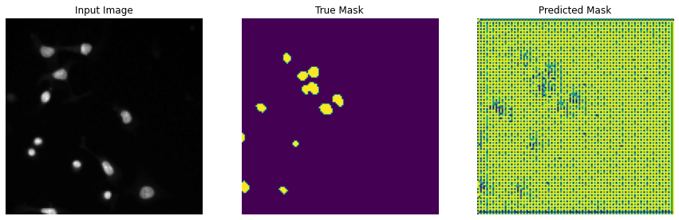
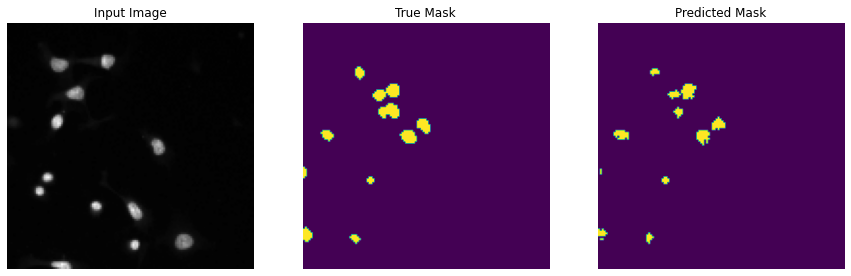
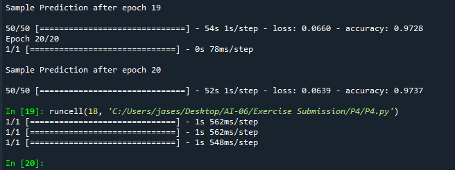
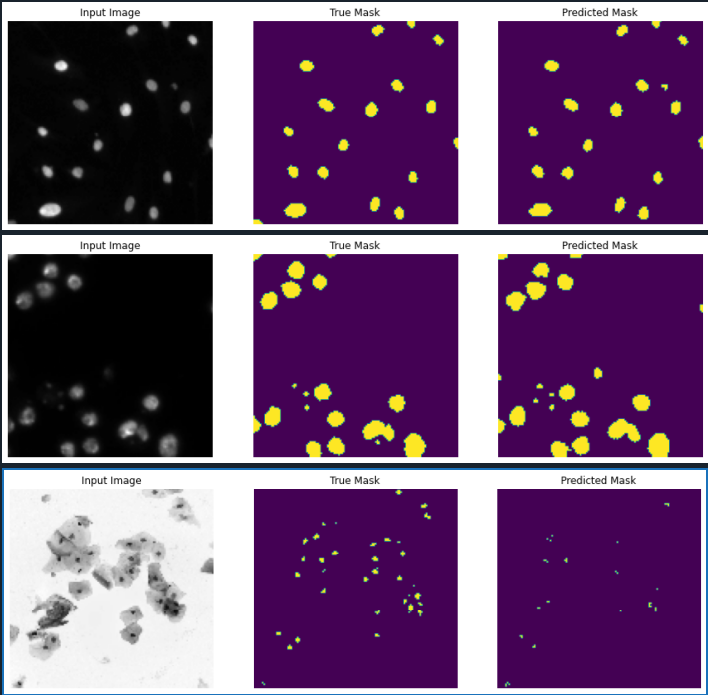

## Github Project 4 - Create a model of Image Segmentation on Cell Nuclei

 1. You are tasked to create a model that can perform image segmentation on Cell Nuclei

 2. Link to source:
    
    https://www.kaggle.com/competitions/data-science-bowl-2018/overview

 3. Link to dataset:
 
    https://shrdc-my.sharepoint.com/:u:/g/personal/kong_kah_chun_shrdc_org_my/Eezac_jW3b9Fiazf0q3cDN4BEUIcOyzln9y95V7ER-orMg?e=qj3pZM

 4. You may apply transfer learning.
 
 ⚡️ Sample train image data
 
 
 
 ⚡️ Sample train mask data
 
 
 
 ⚡️ Image from deployed model (Before training)
 
 
 
 ⚡️ Image after 1st epoch
 
 
 
 ⚡️ Image after 20th epoch
 
 

 ⚡️ Result
 
 
 
 ⚡️ Image from deployed model (After training)
 
 
